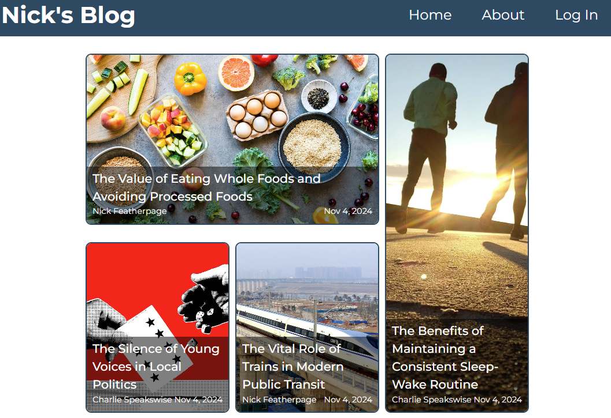
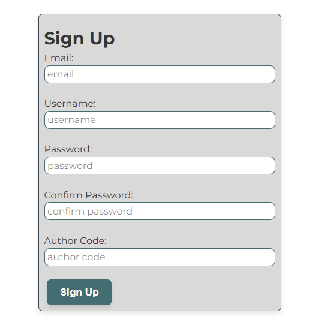
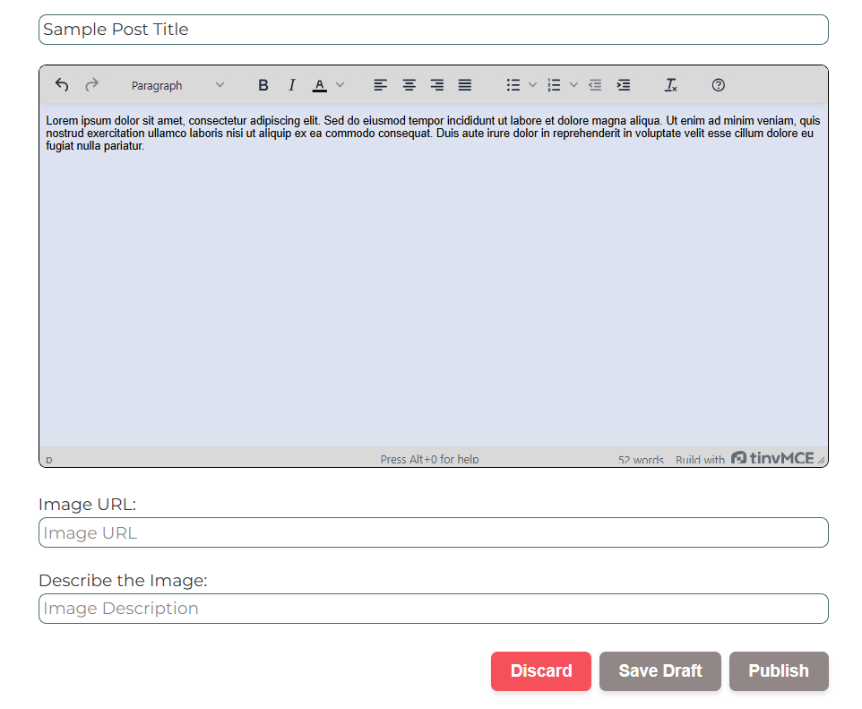

# Full-Stack Blog Project

Full-stack blogging platform integrating a backend with a dynamic frontend that offers a tailored experience for both authors and regular users.
## Live Demo 
https://blog-platform-8okj8n72u-nmufsons-projects.vercel.app/
## Technologies Used
### Frontend
- React.js
- React Router
### Backend
- Node.js
- Express.js
- JSON Web Token (JWT) for authentication
- bcrypt for password hashing
### Database
- PostgreSQL
- Prisma ORM for database management

## Usage

### For All Visitors
1. **Browsing Posts**:
    - Visit the home page to view a collection of blog posts.
    - Click on any post title or image to read the full article.

*Home Page with blog previews*

*Blog Post Page*

2. **Creating an Account**:
    - Navigate to the Sign Up page from the main menu.
    - Fill in your details to create a new account.
    - Optionally, enter an author code if you have one (this grants additional privileges).

*Sign Up form with option to join as an author*

### For Regular Users
3. **Commenting on Posts**:
    - Once logged in, you can leave comments on any blog post.
    - Your comments can be deleted by you at any time.
### For Authors (requires author privileges)
4. **Creating a New Post**:
    - Click the "New Post" button on the home page.
    - Fill in the required fields:
        - Title
        - Content
        - Image URL
        - Image description (for alt text)
    - Choose to either save as a draft or publish immediately.
   

*New Post Page*

5. **Managing Posts**:
    - Edit your posts at any time by clicking the "Edit" icon on your post.
    - Delete your posts using the "Delete" button.
    - Change the status of your post from draft to published or vice versa.
6. **Comment Management**:
    - As an author, you can delete any comments on your own posts.
    - You cannot delete comments on other authors' posts.

## API Endpoints

| Resource     | HTTP Method | Endpoint                     | Description                                                  |
| ------------ | ----------- | ---------------------------- | ------------------------------------------------------------ |
| **Main**     |             |                              |                                                              |
|              | GET         | /                            | Retrieve the home page                                       |
|              | GET         | /about                       | Retrieve the about page                                      |
| **Users**    |             |                              |                                                              |
|              | POST        | /users/signup                | Register a new user and logs them in with token              |
|              | POST        | /users/login                 | Authenticate a user and receive a token                      |
|              | GET         | /users                       | Retrieve all users                                           |
|              | GET         | /users/user/:userId          | Retrieve a specific user's details                           |
|              | POST        | /users/check-email           | Check if an email is available                               |
|              | POST        | /users/check-username        | Check if a username is available                             |
| **Posts**    |             |                              |                                                              |
|              | POST        | /posts                       | Create a new blog post (requires authentication)             |
|              | GET         | /posts                       | Retrieve all blog posts                                      |
|              | GET         | /posts/user/:userId          | Retrieve all posts by a specific user                        |
|              | GET         | /posts/post/:postId          | Retrieve a specific post by its ID                           |
|              | GET         | /posts/latest                | Retrieve the most recent blog post                           |
|              | PUT         | /posts/post/:postId          | Update a specific blog post (requires authentication)        |
|              | DELETE      | /posts/post/:postId          | Delete a specific blog post (requires authentication)        |
| **Comments** |             |                              |                                                              |
|              | POST        | /comments/post/:postId       | Add a comment to a specific post (requires authentication)   |
|              | GET         | /comments/post/:postId       | Retrieve all comments for a specific post                    |
|              | DELETE      | /comments/:postId/:commentId | Delete a specific comment (requires authentication)          |

## Database Schema

Our blog application uses PostgreSQL as the database, with Prisma as the ORM. Here's an overview of our data models:
### User
- `id`: Int (Primary Key, Auto-increment)
- `email`: String (Unique)
- `username`: String (Unique)
- `password`: String
- `canPost`: Boolean (Default: false)
- Relations:
    - Has many Posts
    - Has many Comments
### Post
- `id`: Int (Primary Key, Auto-increment)
- `title`: String
- `content`: String
- `userId`: Int (Foreign Key to User)
- `timestamp`: DateTime (Default: current time)
- `published`: Boolean (Default: false)
- `imageURL`: String (Optional)
- `imageAltText`: String (Optional)
- Relations:
    - Belongs to one User
    - Has many Comments
### Comment
- `id`: Int (Primary Key, Auto-increment)
- `content`: String (Max 500 characters)
- `timestamp`: DateTime (Default: current time)
- `userId`: Int (Foreign Key to User)
- `postId`: Int (Foreign Key to Post)
- Relations:
    - Belongs to one User
    - Belongs to one Post

## Contact Info
For questions, suggestions, or feedback, please contact me at nickmufson1@gmail.com.
